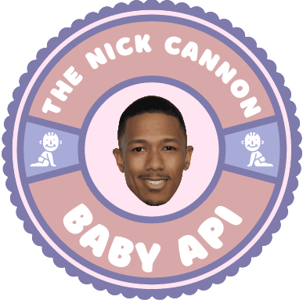

[![MIT License][license-shield]][license-url]
[![LinkedIn][linkedin-shield]][linkedin-url]

<!-- PROJECT LOGO -->
<br />
<p align="center">
  <a href="https://github.com/amamenko/nick-cannon-baby-api">
   
  </a>
   
  <h3 align="center">The Nick Cannon Baby API</h3>

  <p align="center">
    A free JSON API for Nick Cannon's
    <br />
    many children and associated baby mamas
    <br />
  </p>
   <p align="center">API Link: <a href="https://nick-cannon-baby-api.onrender.com/">https://nick-cannon-baby-api.onrender.com</a></p>
   <p align="center">API Documentation: <a href="https://baby.readme.io">https://baby.readme.io</a></p>
</p>

# Usage

## Random Baby

Retrieve a random Nick Cannon baby in JSON format - [https://nick-cannon-baby-api.onrender.com/babies/random](https://nick-cannon-baby-api.onrender.com/babies/random)

<b>Example Response:</b>

```jsonc
[
  {
    "name": "Monroe Cannon",
    "birthday": "04/30/2011",
    "gender": "female",
    "twin": true,
    "approximate_conception_date": "08/07/2010",
    "mother": "Mariah Carey",
    "mother_age_at_birth": 41,
    "nick_cannon_age_at_birth": 30,
    "current_child_with_mother": 1,
    "total_children_with_mother": 2,
    "status": {
      "alive": true,
      "age": {
        "years": 11,
        "months": 6,
        "days": 26
      }
    }
  }
]
```

### Multiple Results

Retrieve a specific number of random Nick Cannon baby results - [https://nick-cannon-baby-api.onrender.com/babies/random?results=5](nick-cannon-baby-api.onrender.com/babies/random?results=5)

<b>Example Response:</b>

```jsonc
[
  {
    "name": "Zillion Heir Cannon",
    "birthday": "06/16/2021",
    "gender": "male",
    "twin": true,
    "approximate_conception_date": "09/23/2020",
    "mother": "Abby De La Rosa",
    "mother_age_at_birth": 30,
    "nick_cannon_age_at_birth": 40,
    "current_child_with_mother": 2,
    "total_children_with_mother": 3,
    "status": {
      "alive": true,
      "age": {
        "years": 1,
        "months": 5,
        "days": 9
      }
    }
  },
  {
    "name": "Rise Messiah Cannon",
    "birthday": "09/23/2022",
    "gender": "male",
    "twin": false,
    "approximate_conception_date": "12/30/2021",
    "mother": "Brittany Bell",
    "mother_age_at_birth": 34,
    "nick_cannon_age_at_birth": 41,
    "current_child_with_mother": 3,
    "total_children_with_mother": 3,
    "status": {
      "alive": true,
      "age": {
        "years": 0,
        "months": 2,
        "days": 2
      }
    }
  }
]
```

### Specify gestation date

Retrieve a random Nick Cannon baby from a date falling between its approximate conception and birth - [https://nick-cannon-baby-api.onrender.com/babies/random?date=05/01/2022&results=5](https://nick-cannon-baby-api.onrender.com/babies/random?date=05/01/2022&results=5)

### Specify mother

Retrieve a random Nick Cannon baby from a specific mother - [https://nick-cannon-baby-api.onrender.com/babies/random?mother=mariah%20carey](https://nick-cannon-baby-api.onrender.com/babies/random?mother=mariah%20carey)

### Specify gender

Retrieve a random Nick Cannon baby of a specific gender - [https://nick-cannon-baby-api.onrender.com/babies/random?gender=male](https://nick-cannon-baby-api.onrender.com/babies/random?gender=male)

## Ordered Baby

Retrieve a specific Nick Cannon baby by his or her index in the chronological order of all results - [https://nick-cannon-baby-api.onrender.com/babies/ordered/0](https://nick-cannon-baby-api.onrender.com/babies/ordered/0)

### Multiple Ordered Baby Results

Retrieve all Nick Cannon babies between a first index and a second index, inclusive, in the chronological order of all results. - [https://nick-cannon-baby-api.onrender.com/babies/ordered/3-7](https://nick-cannon-baby-api.onrender.com/babies/ordered/3-7)

## All Mothers

Retrieve all names of Nick Cannon's baby mamas - [https://nick-cannon-baby-api.onrender.com/babies/mothers](https://nick-cannon-baby-api.onrender.com/babies/mothers)

## All Names

Retrieve all names of Nick Cannon's children - [https://nick-cannon-baby-api.onrender.com/babies/names](https://nick-cannon-baby-api.onrender.com/babies/names)

<!-- LICENSE -->

# License

Distributed under the MIT License. See `LICENSE.txt` for more information.

<!-- CONTACT -->

# Contact

Nick Cannon Baby API - nickcannonbabyapi@gmail.com

Avraham (Avi) Mamenko - avimamenko@gmail.com

API Link: [https://nick-cannon-baby-api.onrender.com/](https://nick-cannon-baby-api.onrender.com/)

API Documentation: [https://baby.readme.io](https://baby.readme.io)

# Disclaimer

The Nick Cannon Baby API is not affiliated, associated, authorized, endorsed by, or in any way officially connected with Nick Cannon, or any of his subsidiaries or affiliates. All motion pictures, products, and brands mentioned on this website are the respective trademarks and copyrights of their owners.

<!-- ACKNOWLEDGEMENTS -->

# Acknowledgements

- [Nick Cannon](https://nickcannon.com/)
- Homepage design inspired by [chucknorris.io](https://api.chucknorris.io/)
- [Best-README-Template](https://github.com/othneildrew/Best-README-Template)
- [ReadMe](https://readme.com)

<!-- MARKDOWN LINKS & IMAGES -->
<!-- https://www.markdownguide.org/basic-syntax/#reference-style-links -->

[license-shield]: https://img.shields.io/github/license/othneildrew/Best-README-Template.svg?style=for-the-badge
[license-url]: https://github.com/amamenko/nick-cannon-baby-api/blob/master/LICENSE.txt
[linkedin-shield]: https://img.shields.io/badge/-LinkedIn-black.svg?style=for-the-badge&logo=linkedin&colorB=555
[linkedin-url]: https://www.linkedin.com/in/avrahammamenko
